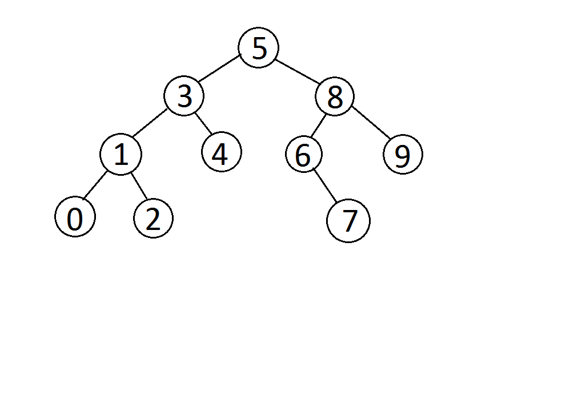

Veri Yapıları ve Algoritmaları Dersinin Üçüncü Projesi

[7, 5, 1, 8, 3, 6, 0, 9, 4, 2] dizisinin Binary-Search-Tree aşamalarını yazınız.

Örnek: root x'dir. root'un sağından y bulunur. Solunda z bulunur vb.

# Root 5'tir. 5'in sağında 8, solunda 3 bulunur.
8'in sağında 9, solunda 6 bulunur.
6'nun sağında 7 bulunur.
3'ün sağında 4, solunda 1 bulunur.
1'in sağında 2, solunda 0 bulunur.

